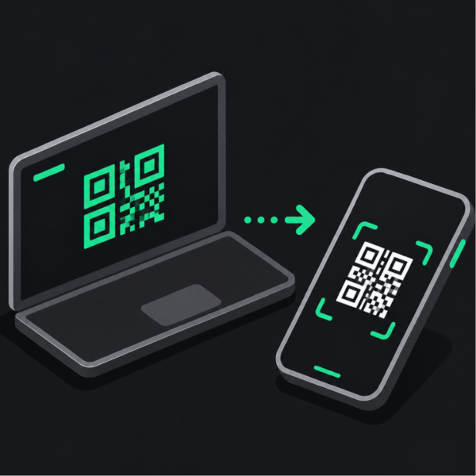

# PLC IO Checker Project Builder

PLC IO Checker Project Builder is a PC tool for creating PLC IO Checker project settings and transferring them to the mobile apps as JSON or QR codes.

Instead of entering long PLC settings on a phone, edit the project on a PC and import it from the Android/iOS app QR scanner.

## Public Manual

- Manual site: <https://fa-yoshinobu.github.io/PlcIoChecker_Site/>
- ProjectBuilder manual: <https://fa-yoshinobu.github.io/PlcIoChecker_Site/projectbuilder/projectbuilder.html>

## Download

Download the Windows executable package from the release Assets:

- Releases: <https://github.com/fa-yoshinobu/PlcIoChecker_ProjectBuilder/releases>
- Asset file: `PlcIoCheckerProjectBuilder-win-x64.zip`

Unzip `PlcIoCheckerProjectBuilder-win-x64.zip`, then start `PlcIoCheckerProjectBuilder.exe`.

Related repositories:

- ProjectBuilder: <https://github.com/fa-yoshinobu/PlcIoChecker_ProjectBuilder>
- Manual site: <https://github.com/fa-yoshinobu/PlcIoChecker_Site>

Primary configuration areas:

- PLC connection settings
- List registration
- Time Chart targets
- Trap settings

This repository contains only the PC-side project builder and QR export tool. The Android and iOS PLC IO Checker apps are separate paid products, and their source code is not included in this repository.

The supported desktop implementation is the .NET WPF app.

## Usage

1. Start `PlcIoCheckerProjectBuilder.exe`.
2. Enter the project and PLC settings.
   - Project name
   - Vendor
   - CPU model
   - IP address, port, and transport
3. Register monitored addresses in `List`.
   - Rows can be pasted from Excel.
   - Columns are `Address / Data type / Comment`.
4. Register graph targets in `Time Chart`.
   - Up to 20 channels can be imported.
5. Register trigger rules in `Trap`.
   - Examples: rising edge, change, greater than or equal.
   - Up to 20 traps can be imported.
6. Save JSON or generate QR pages.
7. In the Android/iOS app, open `QR Import` and scan the displayed QR pages in order.

For multi-page QR output, import completes after the mobile app has scanned every page.

## Scanning Tips

- Display each QR as large as possible.
- Scan one page before moving to the next.
- If a device cannot read the QR reliably, reduce the QR chunk size so the tool generates more smaller QR pages.
- After import, confirm that the project name and List contents changed in the mobile app.

## Documents

- [Build and development](docs/BUILD.md)
- [QR/JSON format](docs/QR_JSON_FORMAT.md)
- [GUI requirements](docs/GUI_REQUIREMENTS.md)

## License

| Item | Value |
| --- | --- |
| License | [MIT](LICENSE) |
| Scope | Applies only to the PC-side project builder and QR export tool in this repository. It does not include the Android/iOS PLC IO Checker mobile apps. |
